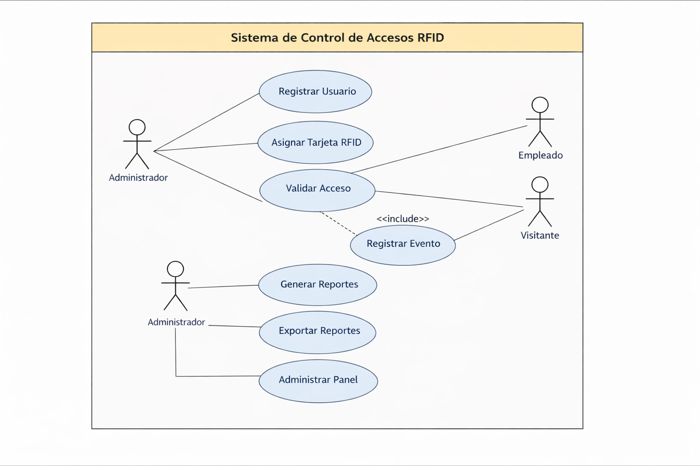

# Sistema de Control de Accesos Empresarial

Proyecto académico de Ingeniería de Software enfocado en el desarrollo de un sistema de control de accesos para empresas mediante tecnología RFID y validación en un servidor central.

## Introducción

En muchas empresas, el control de acceso a áreas restringidas aún se realiza mediante métodos manuales o poco seguros como:

- Llaves físicas
- Registros en papel
- Validaciones verbales

Estos métodos generan varios problemas:

- Falta de trazabilidad
- Riesgos de seguridad
- Accesos no autorizados
- Dificultad para auditar eventos
- Pérdida de información histórica

Para solucionar estas limitaciones, se propone el desarrollo de un sistema de control de accesos basado en tarjetas RFID que permita gestionar entradas y salidas de forma centralizada y en tiempo real.

---

## Objetivo General

Desarrollar un sistema de control de accesos **seguro, escalable y auditable** que permita gestionar el ingreso de personas a la empresa mediante tecnología RFID y validación centralizada.

---

## Alcance del Proyecto

El sistema permitirá:

- Registro de usuarios
- Gestión de tarjetas RFID
- Validación de accesos en tiempo real
- Registro de eventos de acceso
- Panel administrativo
- Generación de reportes
- Exportación de información
- Gestión de ubicaciones o áreas

---

## Analogía del Sistema

El sistema se puede entender mediante la analogía de una **portería inteligente en un conjunto residencial**:

| Elemento real | Sistema |
|---|---|
| Residentes | Usuarios |
| Vigilante | Backend / lógica del sistema |
| Lista de autorizados | Base de datos |
| Torniquete o puerta | Dispositivo RFID |
| Administrador del conjunto | Stakeholder principal |
| Libro de registro | Logs del sistema |

Así como en un conjunto residencial no se permite el ingreso sin validación, el sistema tampoco permitirá accesos sin reglas definidas.

---

## Conceptos Aplicados de Ingeniería de Software

### Software
Programa que controla quién puede ingresar o no a la empresa.

### Requisitos
Definen qué debe hacer el sistema, por ejemplo:

- Registrar usuarios
- Asignar tarjetas RFID
- Validar accesos
- Registrar logs de ingreso
- Bloquear accesos no autorizados

### Proceso
Conjunto de actividades necesarias para desarrollar el sistema.

### Calidad
El sistema debe ser:

- Seguro
- Confiable
- Estable
- Auditable

---

## Problemática y Retos

Durante el desarrollo del sistema pueden presentarse varios desafíos:

- Cambios constantes en los requisitos
- Falta de comunicación con el cliente
- Riesgos de seguridad
- Fallos en la integración hardware-software
- Sobrecostos por mala planificación

Además, existen riesgos técnicos como:

- Fallos del hardware RFID
- Caídas de red
- Clonación de tarjetas
- Cambios en las reglas de acceso

---

## Buenas Prácticas Aplicadas

Para garantizar un desarrollo adecuado se implementan las siguientes prácticas:

- Levantamiento formal de requisitos
- Control de versiones
- Pruebas unitarias
- Pruebas de integración
- Documentación técnica
- Gestión de cambios
- Separación de ambientes (desarrollo, pruebas y producción)

---

## Metodología de Desarrollo

Se utiliza la metodología ágil **Scrum**.

### Razones para usar Scrum

- Permite adaptarse a cambios en los requisitos
- Facilita entregas incrementales
- Reduce riesgos tempranos
- Involucra al cliente constantemente

### Ciclo Scrum Aplicado

**Sprint Planning**  
Definición de funcionalidades del sprint.

**Sprint (2 semanas)**  
Desarrollo de funcionalidades.

**Daily Scrum**  
Seguimiento diario del equipo.

**Sprint Review**  
Presentación de avances al cliente.

**Sprint Retrospective**  
Análisis de mejoras del proceso.

---

## Plan de Sprints

**Sprint 1**
- Autenticación básica RFID

**Sprint 2**
- Registro de accesos en base de datos

**Sprint 3**
- Desarrollo del panel administrativo

**Sprint 4**
- Reportes y auditoría de accesos

---

## Roles del Equipo

### Product Owner
Representante de la empresa y responsable de maximizar el valor del producto.

### Scrum Master
Líder del proyecto encargado de facilitar el trabajo del equipo y eliminar impedimentos.

### Equipo de Desarrollo

- Backend
- Frontend
- Integración hardware
- Base de datos

 

---

## Stakeholders

### Gerente General
- Interés: Alto  
- Influencia: Alta  
- Rol: Aprobación estratégica del proyecto.

### Área de Seguridad
- Interés: Muy alto  
- Influencia: Alta  
- Rol: Definir reglas de acceso.

### Área de TI
- Interés: Alto  
- Influencia: Alta  
- Rol: Soporte técnico y administración del servidor.

### Empleados
- Interés: Medio-Alto  
- Influencia: Media  
- Rol: Usuarios finales del sistema.

### Proveedores
- Interés: Medio  
- Influencia: Media  
- Rol: Soporte técnico y hardware.

---

## Identificación de Riesgos

| Riesgo | Mitigación |
|------|------|
| Fallo del hardware RFID | Pruebas de laboratorio previas |
| Cambios en requisitos | Uso de metodología Scrum |
| Clonación de tarjetas | Encriptación y autenticación |
| Caídas de red | Sistema offline temporal |
| Resistencia al cambio | Capacitación a usuarios |

---

## Herramientas Tecnológicas

**Repositorio de código**
- GitHub

**Gestión del proyecto**
- Monday

**Modelado**
- Draw.io
- StarUML

**Base de datos**
- MySQL

**Backend**
- PHP
**Frontend**
- HTML
- CSS/Boostrap

Estas herramientas permiten:

- Trabajo colaborativo
- Control de versiones
- Gestión ágil
- Documentación visual
- Escalabilidad futura

---

## Conclusión

La ingeniería de software no consiste únicamente en programar.  
Implica planificación, gestión de riesgos, trabajo en equipo y entrega continua de valor.

El desarrollo de este sistema de control de accesos demuestra cómo los conceptos teóricos de la ingeniería de software pueden aplicarse a un problema real dentro de una organización.

Un sistema bien diseñado debe garantizar:

- Seguridad
- Control
- Trazabilidad
- Escalabilidad
